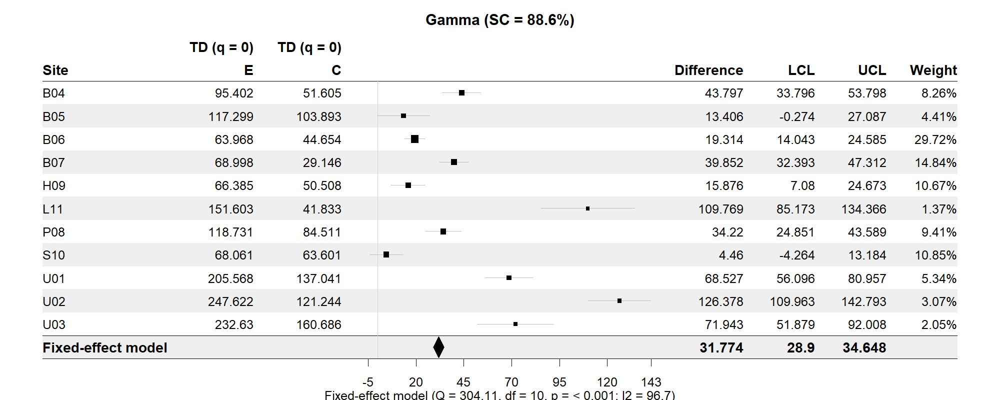
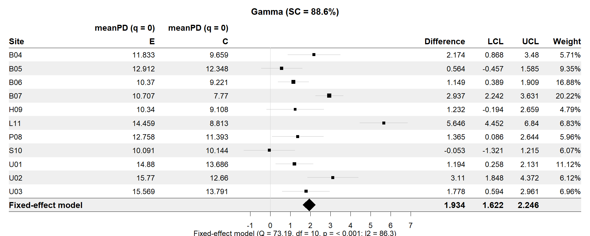
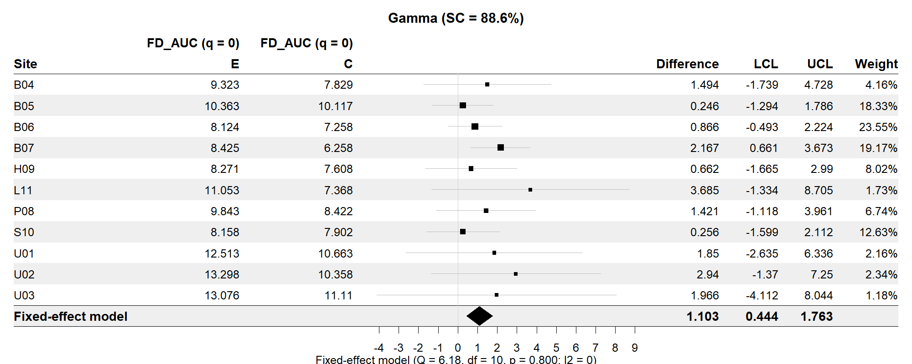

```{r, include = FALSE}
knitr::opts_chunk$set(collapse = TRUE, comment = "#>", 
                      fig.retina = 2,
                      fig.align = 'center',
                      fig.width = 7, fig.height = 3,
                      warning = FALSE, message = FALSE)
#options("width"=200)
library(iNEXT.meta)
library(tidyverse)
```

<font color=#FF6600>
</font>

# An Introduction to iNEXT.meta via Examples

`iNEXT.meta` (Meta-analysis of the difference between two treatments in interpolation and extrapolation for beta diversity across three dimensions)) is an R package that extends the concepts of iNEXT.beta3D (Chao et al., 2023) to meta analysis (fixed-effect model). The iNEXT.meta package provides two example datasets: beetle data and bird data. The beetle dataset contains species abundance data for 1308 beetle species across 11 sites (B04, B05, B06, B07, H09, L11, P08, S10, U01, U02, and U03), each assigned to one of two treatments: Control or Enhanced. The bird dataset consists of species-by-sampling-unit incidence data for 72 bird species collected from 11 sites (B04, B05, B06, B07, H09, L11, P08, S10, U01, U02, and U03), also under the two treatments. In this demonstration, we use the beetle dataset to illustrate the methods.

For each of the three diversity dimensions—taxonomic (TD), phylogenetic (PD), and functional (FD)—iNEXT.meta estimates the difference in standardized diversity between two treatments, based on a common sample coverage, across various diversity types including alpha, beta, and gamma diversity, as well as four dissimilarity measures. The package then applies fixed-effect model to perform meta-analysis across studies or sites. It also includes visualization tools such as forest plots to effectively present the analysis results.


## SOFTWARE NEEDED TO RUN iNEXT.meta IN R
- Required: [R](https://cran.r-project.org/)
- Suggested: [RStudio IDE](https://www.rstudio.com/products/RStudio/#Desktop)


## HOW TO RUN iNEXT.meta:
The `iNEXT.meta` package can be downloaded from Anne Chao's Github [iNEXT.meta_github](https://github.com/AnneChao/iNEXT.meta) using the following commands. For a first-time installation, an additional visualization extension package (`forestplot` from CRAN) and (`iNEXT.beta3D` from CRAN) must be installed and loaded. 

```{r eval=FALSE}
# install INEXT.meta package from CRAN
# install.packages("iNEXT.meta")

## install the latest version from github
#install.packages('devtools')
library(devtools)
# install_github('AnneChao/iNEXT.meta')

## import packages
library(iNEXT.meta)
```


There are three main functions in this package: 

- **DataInfobeta3Dmeta**: Provides basic data information in each combination of site and treatment for (1) the gamma reference sample in the pooled assemblage, and (2) the alpha reference sample in the joint assemblage.

- **iNEXTbeta3Dmeta**: Estimates the difference of standardized 3D diversity with common sample coverage (for alpha, beta, gamma diversity, and four classes of dissimilarity measures) between two treatments, and fit a fixed-effect model to perform meta-analysis.

- **ggiNEXTmeta**: Visualizes the output from the function iNEXTbeta3Dmeta by providing forest plot of the difference between two treatments of standardized 3D diversity in each study/site and meta-analysis (fixed-effect model).

## DATA INFORMATION: FUNCTION DataInfobeta3Dmeta()

The funciton <code>DataInfobeta3Dmeta()</code> provides basic data information in each combination of site and treatment for (1) the gamma reference sample in the pooled assemblage, and (2) the alpha reference sample in the joint assemblage. The function <code>DataInfobeta3Dmeta()</code> with default arguments is shown below:

```{r, eval=FALSE}
iNEXTbeta3Dmeta(data, diversity = "TD", datatype = "abundance", 
                PDtree = NULL, PDreftime = NULL,
                FDdistM = NULL, FDtype = "AUC", FDtau = NULL)
```

The arguments of this function are briefly described below, and will be explained in more details by illustrative examples in later text. 

<table style="width:100%;">
<colgroup>
<col width="20%">
<col width="80%">
</colgroup>
<thead>
<tr class="header">
<th align="center">Argument</th>
<th align="left">Description</th>

</tr>
</thead>
<tbody>
<tr class="odd">
<td align="center"><code>data</code></td>
<td align="left">
(a) For <code>datatype = "abundance"</code>, data can be input as a data.frame (assemblages by species). The data frame has study/site and treatment as the first two columns, followed by columns for species names. Here an assemblage refers to a combination of study/site and
treatment. \cr
(b) For <code>datatype = "incidence_raw"</code>, data can be input as a data.frame. The data frame has study/site, treatment, patch as the first three columns, followed by columns for species names.</td>

</tr>
<tr class="even">
<td align="center"><code>diversity</code></td>
<td align="left">Selection of diversity type: "TD" = Taxonomic diversity, "PD" = Phylogenetic diversity, and "FD" = Functional diversity.</td>

</tr>
<tr class="odd">
<td align="center"><code>datatype</code></td>
<td align="left">Data type of input data: individual-based abundance data (<code>datatype = "abundance"</code>) or species by sampling-units incidence data (<code>datatype = "incidence_raw"</code>) with all entries being 0 (non-detection) or 1 (detection).</td>

</tr>
<tr class="even">
<td align="center"><code>PDtree</code></td>
<td align="left">(required only when <code>diversity = "PD"</code>), a phylogenetic tree in Newick format for all observed species in the pooled data.</td>

</tr>
<tr class="odd">
<td align="center"><code>PDreftime</code></td>
<td align="left">(required only when <code>diversity = "PD"</code>), a numerical value specifying reference times for PD. Default is <code>NULL</code> (i.e., the age of the root of PDtree).</td>

</tr>
<tr class="even">
<td align="center"><code>FDdistM</code></td>
<td align="left">(required only when <code>diversity = "FD"</code>), a species pairwise distance matrix for all species in the pooled data.</td>

</tr>
<tr class="odd">
<td align="center"><code>FDtype</code></td>
<td align="left">(required only when <code>diversity = "FD"</code>), select FD type: <code>FDtype = "tau_value"</code> for FD under a specified threshold value, or <code>FDtype = "AUC"</code> (area under the curve of tau-profile) for an overall FD which integrates all threshold values between zero and one. Default is <code>FDtype = "AUC"</code>.</td>

</tr>
<tr class="even">
<td align="center"><code>FDtau</code></td>
<td align="left">(required only when <code>diversity = "FD"</code> and <code>FDtype = "tau_value"</code>), a numerical value between 0 and 1 specifying the tau value (threshold level) that will be used to compute FD. If <code>FDtau = NULL</code> (default), then threshold is set to be the mean distance between any two individuals randomly selected from the pooled data (i.e., quadratic entropy).</td>

</tbody>
</table>

Running the <code>DataInfobeta3Dmeta()</code> function returns basic data information including sample size, observed species richness, and sample coverage. For abundance data, it provides both <code>SC(n)</code> and <code>SC(2n)</code>; for incidence data, it provides <code>SC(T)</code> and <code>SC(2T)</code>. The output also includes other relevant information across the three dimensions of diversity. We demonstrate the function using the <code>Beetle_abundance_data</code> dataset for each dimension.

```{r, eval=FALSE}
## Data information for taxonomic diversity
data("Beetle_abundance_data")
infooutput1 <- DataInfobeta3Dmeta(data = Beetle_abundance_data, diversity = "TD", datatype = "abundance")

infooutput1
```

```{r, echo=FALSE}
## Data information for taxonomic diversity
data("Beetle_abundance_data")
infooutput1 <- DataInfobeta3Dmeta(data = Beetle_abundance_data, diversity = "TD", datatype = "abundance")

infooutput1[1:15, ]
```

Output description:

- <code>Site</code> = the input sites.

- <code>Treatment</code> = the input two treatment.

- <code>Assemblage</code> = individual assemblages, "Pooled assemblage" (for gamma) or "Joint assemblage" (for alpha).

- <code>n</code> = number of observed individuals in the reference sample (sample size).

- <code>S.obs</code> = number of observed species in the reference sample.

- <code>SC(n)</code> = sample coverage estimate of the reference sample.

- <code>SC(2n)</code> = sample coverage estimate of twice the reference sample size.

- <code>f1</code>-<code>f5</code> = the first five species abundance frequency counts in the reference sample.

```{r, eval=FALSE}
## Data information for phylogenetic diversity
data("Beetle_abundance_data")
data("Beetle_tree")
infooutput2 <- DataInfobeta3Dmeta(data = Beetle_abundance_data, diversity = "PD", datatype = "abundance",
                                  PDtree = Beetle_tree, PDreftime = NULL)

infooutput2
```

```{r, echo=FALSE}
## Data information for phylogenetic diversity
data("Beetle_abundance_data")
data("Beetle_tree")
infooutput2 <- DataInfobeta3Dmeta(data = Beetle_abundance_data, diversity = "PD", datatype = "abundance",
                                  PDtree = Beetle_tree, PDreftime = NULL)

infooutput2[1:15, ]
```

Information description:

- <code>Site</code>, <code>Treatment</code>, <code>Assemblage</code>, <code>n</code>, <code>S.obs</code>, <code>SC(n)</code>, <code>SC(2n)</code> = definitions are the same as in the TD output.

- <code>PD.obs</code> = the observed total branch length in the phylogenetic tree spanned by all observed species.

- <code>f1\*</code>, <code>f2\*</code> = the number of singletons and doubletons in the node/branch abundance set.

- <code>g1</code>. <code>g2</code> = the total branch length of those singletons/doubletons in the node/branch abundance set.

- <code>Reftime</code> = reference time for phylogenetic diversity (the age of the root of phylogenetic tree).

```{r, eval=FALSE}
## Data information for functional diversity (under a specified threshold level, FDtype = "tau_value")
data("Beetle_abundance_data")
data("Beetle_distM")
infooutput3 <- DataInfobeta3Dmeta(data = Beetle_abundance_data, diversity = "FD", datatype = "abundance",
                                  FDdistM = Beetle_distM, FDtype = "tau_value", FDtau = NULL)

infooutput3
```

```{r, echo=FALSE}
## Data information for functional diversity (under a specified threshold level, FDtype = "tau_value")
data("Beetle_abundance_data")
data("Beetle_distM")
infooutput3 <- DataInfobeta3Dmeta(data = Beetle_abundance_data, diversity = "FD", datatype = "abundance",
                                  FDdistM = Beetle_distM, FDtype = "tau_value", FDtau = NULL)

infooutput3[1:15, ]
```

Information description:

- <code>Site</code>, <code>Treatment</code>, <code>Assemblage</code>, <code>n</code>, <code>S.obs</code>, <code>SC(n)</code>, <code>SC(2n)</code> = definitions are the same as in the TD output.

- <code>a1\*</code>, <code>a2\*</code> = the number of singletons (<code>a1\*</code>) and of doubletons (<code>a2*</code>) among the functionally indistinct set at the specified threshold level <code>"Tau"</code>.

- <code>h1</code>, <code>h2</code> = the total contribution of singletons (<code>h1</code>) and of doubletons (<code>h2</code>) at the specified threshold level <code>"Tau"</code>.

- <code>Tau</code> = the specified threshold level of distinctiveness. Default is dmean (the mean distance between any two individuals randomly selected from the pooled data over all datasets).

```{r, eval=FALSE}
## Data information for functional diversity (FDtype = "AUC")
data("Beetle_abundance_data")
data("Beetle_distM")
infooutput4 <- DataInfobeta3Dmeta(data = Beetle_abundance_data, diversity = "FD", datatype = "abundance",
                                  FDdistM = Beetle_distM, FDtype = "AUC")

infooutput4
```

```{r, echo=FALSE}
## Data information for functional diversity (FDtype = "AUC")
data("Beetle_abundance_data")
data("Beetle_distM")
infooutput4 <- DataInfobeta3Dmeta(data = Beetle_abundance_data, diversity = "FD", datatype = "abundance",
                                  FDdistM = Beetle_distM, FDtype = "AUC")

infooutput4[1:15, ]
```

Information description:

- <code>Site</code>, <code>Treatment</code>, <code>Assemblage</code>, <code>n</code>, <code>S.obs</code>, <code>SC(n)</code>, <code>SC(2n)</code> = definitions are the same as in the TD output.

- <code>dmin</code> = the minimum distance among all non-diagonal elements in the distance matrix.

-<code>dmean</code> = the mean distance between any two individuals randomly selected from each assemblage.

-<code>dmax</code> = the maximum distance among all elements in the distance matrix.

## MAIN FUNCTION: iNEXTbeta3Dmeta()

We first describe the main function `iNEXTbeta3Dmeta()` with default arguments:

```{r eval=FALSE}
iNEXTbeta3Dmeta(data, diversity = "TD", order.q = c(0, 1, 2), datatype = "abundance", 
                level = NULL, nboot = 10, treatment_order = c("Enhanced", "Control"), conf = 0.95,
                PDtree, PDreftime = NULL, PDtype = "meanPD", FDdistM, FDtype = "AUC", FDtau = NULL, FDcut_number = 30)
```

The arguments of this function are briefly described below, and will be explained in more details by illustrative examples in later text.

<table style="width:100%;">
<colgroup>
<col width="20%">
<col width="80%">
</colgroup>
<thead>
<tr class="header">
<th align="center">Argument</th>
<th align="left">Description</th>

</tr>
</thead>
<tbody>
<tr class="odd">
<td align="center"><code>data</code></td>
<td align="left">
(a) For <code>datatype = "abundance"</code>, data can be input as a data.frame (assemblages by species). The data frame has study/site and treatment as the first two columns, followed by columns for species names. Here an assemblage refers to a combination of study/site and
treatment. \cr
(b) For <code>datatype = "incidence_raw"</code>, data can be input as a data.frame. The data frame has study/site, treatment, patch as the first three columns, followed by columns for species names.</td>

</tr>
<tr class="even">
<td align="center"><code>diversity</code></td>
<td align="left">Selection of diversity type: "TD" = Taxonomic diversity, "PD" = Phylogenetic diversity, and "FD" = Functional diversity.</td>

</tr>
<tr class="odd">
<td align="center"><code>order.q</code></td>
<td align="left">A numerical value specifying the diversity order, Default is <code>q = 0, 1, 2</code>.</td>

</tr>
<tr class="even">
<td align="center"><code>datatype</code></td>
<td align="left">Data type of input data: individual-based abundance data (<code>datatype = "abundance"</code>) or species by sampling-units incidence data (<code>datatype = "incidence_raw"</code>) with all entries being 0 (non-detection) or 1 (detection).</td>

</tr>
<tr class="odd">
<td align="center"><code>level</code></td>
<td align="left">A numerical value between 0 and 1 specifying the sample coverage level used for computing standardized diversity and dissimilarity. By default(</code>level = NULL</code>), the function automatically calculates standardized 3D gamma, alpha, and beta diversities, along with four dissimilarity indices, up to the minimum coverage achieved by doubling the reference sample size across all site and treatment combinations.</td>

</tr>
<tr class="even">
<td align="center"><code>nboot</code></td>
<td align="left">A positive integer specifying the number of bootstrap replications when assessing sampling uncertainty for estimating standardized beta3D diversity and the associated confidence intervals. Default is 10. If more accurate results are required, set <code>nboot = 100</code> (or <code>nboot = 200</code>).</td>

</tr>
<tr class="odd">
<td align="center"><code>treatment_order</code></td>
<td align="left">A character vector for the names of treatment. The difference of standardized beta3D diversity will be computed as diversity of the first treatment minus the diversity of second treatment.</td>

</tr>
<tr class="even">
<td align="center"><code>conf</code></td>
<td align="left">A positive number < 1 specifying the level of confidence interval. Default is <code>conf = 0.95</code>.</td>

</tr>
<tr class="odd">
<td align="center"><code>PDtree</code></td>
<td align="left">(required only when <code>diversity = "PD"</code>), a phylogenetic tree in Newick format for all observed species in the pooled data.</td>

</tr>
<tr class="even">
<td align="center"><code>PDreftime</code></td>
<td align="left">(required only when <code>diversity = "PD"</code>), a numerical value specifying reference times for PD. Default is <code>NULL</code> (i.e., the age of the root of PDtree).</td>

</tr>
<tr class="odd">
<td align="center"><code>PDtype</code></td>
<td align="left">(required only when <code>diversity = "PD"</code>), select PD type: <code>PDtype = "PD"</code> (effective total branch length) or <code>PDtype = "meanPD"</code> (effective number of equally divergent lineages). Default is <code>PDtype = "meanPD"</code>, where <code>meanPD</code> = PD/tree depth.</td>

</tr>
<tr class="even">
<td align="center"><code>FDdistM</code></td>
<td align="left">(required only when <code>diversity = "FD"</code>), a species pairwise distance matrix for all species in the pooled data.</td>

</tr>
<tr class="odd">
<td align="center"><code>FDtype</code></td>
<td align="left">(required only when <code>diversity = "FD"</code>), select FD type: <code>FDtype = "tau_value"</code> for FD under a specified threshold value, or <code>FDtype = "AUC"</code> (area under the curve of tau-profile) for an overall FD which integrates all threshold values between zero and one. Default is <code>FDtype = "AUC"</code>.</td>

</tr>
<tr class="even">
<td align="center"><code>FDtau</code></td>
<td align="left">(required only when <code>diversity = "FD"</code> and <code>FDtype = "tau_value"</code>), a numerical value between 0 and 1 specifying the tau value (threshold level) that will be used to compute FD. If <code>FDtau = NULL</code> (default), then threshold is set to be the mean distance between any two individuals randomly selected from the pooled data (i.e., quadratic entropy).</td>

</tr>
<tr class="odd">
<td align="center"><code>FDcut_number</code></td>
<td align="left">(required only when <code>diversity = "FD"</code> and <code>FDtype = "AUC"</code>), a numeric number to cut [0, 1] interval into equal-spaced sub-intervals to obtain the AUC value by integrating the tau-profile. Equivalently, the number of tau values that will be considered to compute the integrated AUC value. Default is 30. A larger value can be set to obtain more accurate AUC value. </td>

</tbody>
</table>

This function returns an `"iNEXTbeta3Dmeta"` object which can be further used to make plots using the function `ggiNEXTmeta()` to be described below. 


## DATA INPUT FORMAT

To perform meta-analysis across studies or sites, the input dataset must follow specific formatting rules depending on the data type:

### Abundance Data (`datatype = "abundance"`)

- The input must be a `data.frame` with:
  - **First two columns**:  
    - `Site`: study or site name  
    - `Treatment`: treatment condition (e.g., Control, Enhanced)
  - **Remaining columns**:  
    - Species names as column headers  
    - Cell values indicate the **abundance** of each species in the assemblage

### Incidence Data (`datatype = "incidence_raw"`)

- The input must be a `data.frame` with:
  - **First three columns**:  
    - `Site`: study or site name  
    - `Treatment`: treatment condition  
    - `Patch`: each patch within the same site and treatment combination should have the same sampling unit ID
  - **Remaining columns**:  
    - Species names as column headers  
    - Entries should be **0 or 1**, indicating absence or presence in each patch

---

Each **row** in the dataset represents a unique **assemblage**, defined by the combination of `Site` and `Treatment`.

There is **no need to manually concatenate** these columns into a single string (e.g., `"Site_B04_Control"`). The functions in the `iNEXT.meta` package will handle grouping and labeling automatically.

These assemblages are used to compute standardized diversity metrics (taxonomic, phylogenetic, or functional) and to compare treatment effects across multiple studies/sites for meta-analysis.

## Beetle Species Abundance Data Example

We use beetle species incidence data collected from **eleven sites** under **two treatments** (Enhanced and Control). The dataset is named `Beetle_abundance_data` and is included in the `iNEXT.meta` package.

The dataset is formatted as a **single data frame** suitable for `datatype = "abundance"`. The data includes:

- `Site`: the study site (e.g., "B04", "P08", "U03")
- `Treatment`: the treatment type (`"Enhanced"` or `"Control"`)

This format allows the functions in the `iNEXT.meta` package to automatically recognize and group assemblages by site and treatment for further analysis.

You can load and view the dataset using the following code:


```{r, eval=FALSE}
data("Beetle_abundance_data")
Beetle_abundance_data
```

```{r, echo=FALSE}
data("Beetle_abundance_data")
Beetle_abundance_data[1:15, 1:5]
```

#### Phylogenetic tree format for PD  

To perform PD analysis, the phylogenetic tree (in Newick format) spanned by species observed in all datasets must be stored in a txt file. For example, the phylogenetic tree for all observed species is stored in a data file named "Beetle_tree" for demonstration purpose. A partial list of the tip labels are shown below. 

```{r}
data("Beetle_tree")
Beetle_tree
```

#### Species pairwise distance matrix format for FD

To perform FD analysis, the species-pairwise distance matrix (Gower distance computed from species traits) for species observed in all datasets must be stored in a matrix/data.frame format. Typically, the distance between any two species is computed from species traits using the Gower distance. In our demo data, the distance matrix for all species is stored in a csv file named "Beetle_distM" for demonstration purpose. Here we only show the first three rows and three columns of the distance matrix.

```{r, eval=FALSE}
data("Beetle_distM")
Beetle_distM
```

```{r, echo=FALSE}
data("Beetle_distM")
round(Beetle_distM[1:3, 1:3], 3)
```


## Output of the main function iNEXTbetameta() 

The `iNEXTbeta3Dmeta()` function returns a **list with seven components**: `Gamma`, `Alpha`, `Beta`, `1-C`, `1-U`, `1-V`, and `1-S`.

Each component is itself a list containing:

### 1. A `data.frame` of site-level estimates

Each row corresponds to a unique study or site, and includes the following columns:

- `Site`: the name of the study/site (automatically taken from the `Site` column in the input)
- `Order.q`: the order of diversity (q = 0, 1, or 2)
- `Diversity`: the dimension of diversity (TD = Taxonomic, PD = Phylogenetic, FD = Functional)
- `Difference`: the difference in diversity between two treatments (calculated as *first treatment* − *second treatment*, based on `treatment_order`)
- `SE`: the standard error of the difference
- `LCL`, `UCL`: the lower and upper 95% confidence limits of the difference
- Two columns named after the treatments (e.g., `Enhanced`, `Control`), showing the estimated diversity values for each treatment in the corresponding site
- `Weight`: the weight assigned to each site for meta-analysis

### 2. A summary table

This includes the following meta-analytic statistics:

- `Q_val`: Cochran’s Q statistic
- `df_val`: degrees of freedom
- `p_val`: p-value of the heterogeneity test
- `I2_val`: percentage of heterogeneity (I²)

This structured output enables both per-site interpretation and global inference through meta-analysis.


## Taxonomic diversity

First, we run the `iNEXTbeta3Dmeta()` function with `Beetle_abundance-data` to compute the difference of taxonomic diversity between two treatments across all sites and perform meta analysis by running the following code: 

```{r, eval=FALSE}
# Taxonomic diversity

data("Beetle_abundance_data")
output1 <- iNEXTbeta3Dmeta(data = Beetle_abundance_data, diversity = "TD", 
                            order.q = 0, datatype = "abundance", level = NULL, 
                            nboot = 100, treatment_order = c("E", "C"), conf = 0.95)
```

```{r, echo=FALSE}
# Taxonomic diversity

data("Beetle_abundance_data")
output1 <- iNEXTbeta3Dmeta(data = Beetle_abundance_data, diversity = "TD", 
                            order.q = 0, datatype = "abundance", level = NULL, 
                            nboot = 100, treatment_order = c("E", "C"), conf = 0.95)
# cbind(output1c[[1]][,1:3], round(output1c[,4:10], 2))
```

```{r, echo=FALSE}
output1[[1]][1] |> as.data.frame() %>% mutate(across(c(2, 3, 4, 5, 8, 9, 10), ~ round(. , 2)))
```

```{r, echo=FALSE}
output1[[1]][2]
```

## Phylogenetic diversity

As with taxonomic diversity, `iNEXT.meta` computes the difference of phylogenetic diversity between two treatments across all sites and perform meta analysis.  

The required argument for performing PD analysis is `PDtree`. For example, the phylogenetic tree for all observed species is stored in a txt file named "Beetle_tree". Then we enter the argument `PDtree = Beetle_tree`. Two optional arguments are: `PDtype` and `PDreftime`. There are two options for `PDtype`: `"PD"` (effective total branch length) or `"meanPD"` (effective number of equally divergent lineages, meanPD = PD/tree depth). Default is `PDtype = "meanPD"`. `PDreftime` is a numerical value specifying a reference time for computing phylogenetic diversity. By default (`PDreftime = NULL`), the reference time is set to the tree depth, i.e., age of the root of the phylogenetic tree.

Run the following code to perform PD analysis. The output is similar to the taxonomic diversity and thus is omitted; see later graphical display of the output.

```{r, eval=FALSE}
## Phylogenetic diversity

data("Beetle_abundance_data")
data("Beetle_tree")
output2 <- iNEXTbeta3Dmeta(data = Beetle_abundance_data, diversity = "PD", 
                            order.q = 0, datatype = "abundance", level = NULL, 
                            nboot = 10, treatment_order = c("E", "C"), conf = 0.95, 
                            PDtree = Beetle_tree, PDreftime = NULL, PDtype = "meanPD")

output2
```


## Functional diversity 

As with taxonomic and phylogenetic diversity, `iNEXT.meta` computes the difference of functional diversity between two treatments across all sites and perform meta analysis. 

The required argument for performing FD analysis is `FDdistM`. For example, the distance matrix for all species is stored in a csv file named "Beetle_distM". Then we enter the argument `FDdistM = Beetle_distM`. Three optional arguments are (1) `FDtype`: `FDtype = "AUC"` means FD is computed from the area under the curve of a tau-profile by integrating all plausible threshold values between zero and one; `FDtype = "tau-value"` means FD is computed under a specific threshold value to be specified in the argument `FD_tau`. (2) `FD_tau`: a numerical value specifying the tau value (threshold level) that will be used to compute FD. If `FDtype = "tau-value"` and `FD_tau = NULL`, then the threshold level is set to be the mean distance between any two individuals randomly selected from the pooled data over all datasets (i.e., quadratic entropy). (3)  `FDcut_number` is a numeric number to cut [0, 1] interval into equal-spaced sub-intervals to obtain the AUC value. Default is `FDcut_number = 30`. If more accurate integration is desired, then use a larger integer. 

Run the following code to perform FD analysis. The output is similar to the taxonomic diversity and thus is omitted; see later graphical display of the output. 

```{r, eval=FALSE}
## Functional diversity

data("Beetle_abundance_data")
data("Beetle_distM")
output3 <- iNEXTbeta3Dmeta(data = Beetle_abundance_data, diversity = "FD", 
                            order.q = 0, datatype = "abundance", level = NULL, 
                            nboot = 10, treatment_order = c("E", "C"), conf = 0.95,
                            FDdistM = Beetle_distM, FDtype = "AUC", FDcut_number = 30)

output3
```


## GRAPHIC DISPLAYS: FUNCTION ggiNEXmeta()

The function `ggiNEXTmeta()` with default arguments is described as follows: 

```{r eval=FALSE}
ggiNEXTmeta(output, q, num_round = 3, range, type, level = NULL)
```

<table style="width:100%;">
<colgroup>
<col width="20%">
<col width="80%">
</colgroup>
<thead>
<tr class="header">
<th align="center">Argument</th>
<th align="left">Description</th>
</tr>
</thead>
<tbody>
<tr class="odd">
<td align="center"><code>output</code></td>
<td align="left">The output of the <code>iNEXTbeta3Dmeta<code> function.</td>

</tr>
<tr class="even">
<td align="center"><code>order.q</code></td>
<td align="left">A previously appeared "Order.q" value in "output"</td>

</tr>
<tr class="odd">
<td align="center"><code>num_round</code></td>
<td align="left">A numerical value that the values show on the plot are rounded to the specified value of decimal places. Default is 3.</td>

</tr>
<tr class="even">
<td align="center"><code>range</code></td>
<td align="left">Lower and upper limits for clipping confidence intervals to arrows.</td>

</tr>
<tr class="odd">
<td align="center"><code>type</code></td>
<td align="left">Specify diversity type ("Gamma", "Alpha", "Beta"), or dissimilarity type ("1-C", "1-U", "1-V", "1-S").</td>

</tr>
<tr class="even">
<td align="center"><code>level</code></td>
<td align="left">An optional sample coverage value (between 0 and 100 percent) to be annotated on the forest plot, indicating the fixed sample coverage used; if <code>level = NULL</code>, the annotation will be omitted.</td>

</tbody>
</table>

The `ggiNEXTmeta()` function is a wrapper around the `forestplot` package. `ggiNEXTmeta()` provides forest plot for visualizing the output of `iNEXTbeta3Dmeta()`. Run the following code to display the plot for the output of `iNEXTbeta3Dmeta()` with taxonomic, phylogenetic and functional diversity, respectively:

```{r, eval=FALSE}
## Taxonomic diversity

data("Beetle_abundance_data")
infooutput <- DataInfobeta3Dmeta(data = Beetle_abundance_data, diversity = "TD", datatype = "abundance")
level1 <- infooutput |> filter(Assemblage == "Joint assemblage") |> pull(`SC(2n)`) |> min()
output1 <- iNEXTbeta3Dmeta(data = Beetle_abundance_data, diversity = "TD",
                           order.q = 0, datatype = "abundance", level = level1,
                           nboot = 100, treatment_order = c("E", "C"), conf = 0.95)

ggiNEXTmeta(output1, q = 0, num_round = 3, range = c(-20, 15), type = "Gamma", level = round(level1, 3) * 100)
```
{width="98%"}


```{r, eval=FALSE}
## Phylogenetic diversity

data("Beetle_abundance_data")
data("Beetle_tree")
infooutput <- DataInfobeta3Dmeta(data = Beetle_abundance_data, diversity = "TD", datatype = "abundance")
level1 <- infooutput |> filter(Assemblage == "Joint assemblage") |> pull(`SC(2n)`) |> min()
output2 <- iNEXTbeta3Dmeta(data = Beetle_abundance_data, diversity = "PD", 
                           order.q = 0, datatype = "abundance", level = NULL, 
                           nboot = 10, treatment_order = c("E", "C"), conf = 0.95, 
                           PDtree = Beetle_tree, PDreftime = NULL, PDtype = "meanPD")

ggiNEXTmeta(output2, q = 0, num_round = 3, range = c(-20, 15), type = "Gamma", level = round(level1, 3) * 100)
```
{width="98%"}


```{r, eval=FALSE}
## Functional diversity

data("Beetle_abundance_data")
data("Beetle_distM")
infooutput <- DataInfobeta3Dmeta(data = Beetle_abundance_data, diversity = "TD", datatype = "abundance")
level1 <- infooutput |> filter(Assemblage == "Joint assemblage") |> pull(`SC(2n)`) |> min()
output3 <- iNEXTbeta3Dmeta(data = Beetle_abundance_data, diversity = "FD", 
                           order.q = 0, datatype = "abundance", level = NULL, 
                           nboot = 10, treatment_order = c("E", "C"), conf = 0.95,
                           FDdistM = Beetle_distM, FDtype = "AUC", FDcut_number = 30)

ggiNEXTmeta(output3, q = 0, num_round = 3, range = c(-20, 15), type = "Gamma", level = round(level1, 3) * 100)
```
{width="98%"}


